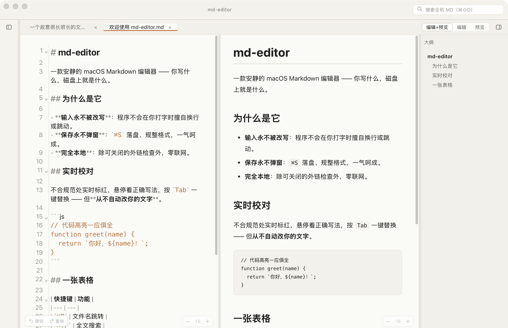
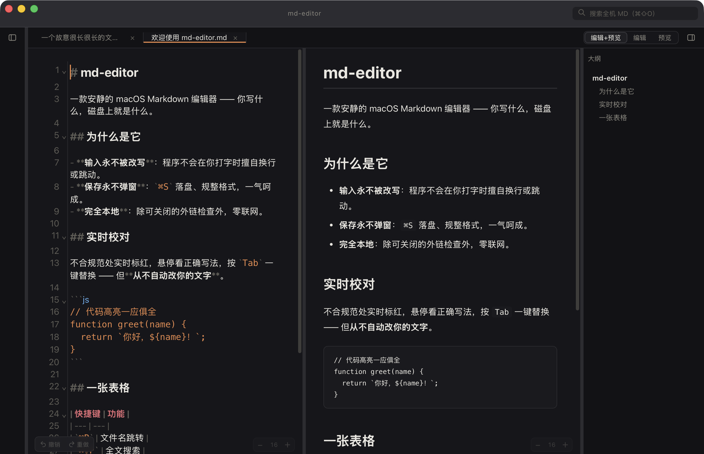

# md-editor

一个轻量、简单的 macOS Markdown 阅读和编辑工具。体积小、打开快、上手容易。输入的内容不会被程序改写，保存不弹窗，完全本地运行。





## 功能

- 边写边看：左边编辑，右边实时预览
- 文件树：浏览目录、新建、重命名、拖拽
- 多标签页，可恢复会话（关掉后重开，之前打开的文件还在）
- 大纲导航，预览与大纲同步滚动
- Markdown 规范检查：不规范的地方标红、悬停看正确写法、按 `Tab` 一键修正（从不自动改你的文字）
- 搜索：全局搜索、按文件名跳转、全文搜索
- 导出 HTML
- 深色 / 浅色主题
- 双击 `.md` 文件直接打开

## 系统要求

- macOS 10.15 (Catalina) 及以上
- Apple Silicon 与 Intel 均可（通用二进制）

## 下载与安装

### 方式一：一行命令安装（推荐）

打开「终端 / Terminal」（在 启动台→其他→终端，或用 Spotlight 搜「终端」），粘贴下面这行，回车：

```bash
curl -fsSL https://raw.githubusercontent.com/cxiaohuan2011/MD-editor/main/install.sh | bash
```

- 自动下载最新版、装进「应用程序」并打开，全程没有任何拦截弹窗
- 不会请求管理员密码
- 脚本本身就在本仓库里，[点这里查看它做了什么](install.sh)

装完以后直接双击图标即可使用。

### 方式二：手动下载 dmg

1. 到 [Releases](https://github.com/cxiaohuan2011/MD-editor/releases) 下载最新的 `md-editor_*_universal.dmg`
2. 打开 dmg，把 **md-editor** 拖进「应用程序 / Applications」
3. 首次打开会被 macOS 拦截，提示「已损坏」或「未验证的开发者」——这不是应用坏了，只是没买苹果的公证服务（$99/年）。解决二选一：
   - **方法 A（推荐，一次搞定）**：终端运行 `xattr -dr com.apple.quarantine /Applications/md-editor.app`，之后双击正常打开，不再拦
   - **方法 B（系统设置放行）**：先双击 app 触发一次拦截弹窗（点「完成」关掉，别点「移到废纸篓」）→ 打开 系统设置 → 隐私与安全性 → 拉到底部「安全性」区域 → 看到「已阻止 md-editor…」→ 点「仍要打开」→ 输密码或 Touch ID 确认。（不同 macOS 版本这个入口的文字略有差异）

> 只对你信任来源的应用做去隔离。本应用完全本地运行、不联网、不收集任何数据，安装脚本也公开在仓库里可以查看。

## 许可

闭源免费软件，免费供个人非商业使用，版权归作者所有，禁止再分发、转售、反编译。详见 [LICENSE](LICENSE)。
